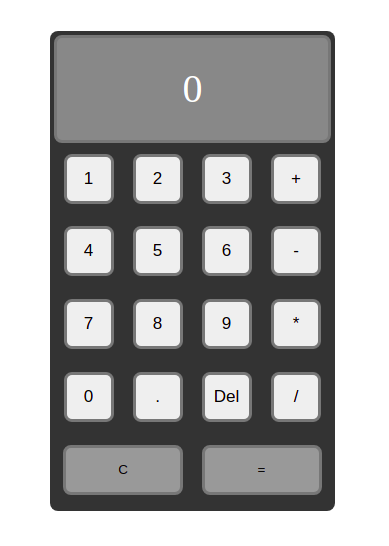

# Classin Calcualtor build with React

The App is a calculator, which uses React to work with state. Calc can sum, devide, multiply or substracts numbers.

<a href="https://bullet03.github.io/calculator_react/">DEMO<a>

- React v17 (CRA)
- CSS modules

### To Run Locally

- clone the repo;
- use npm install/yarn to install all the dependencies
- use npm start/yarn start to run locally